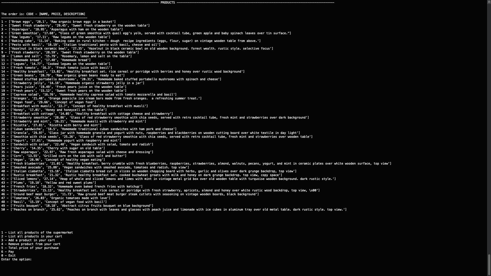

# Cashier

**Número da Lista**: 3<br>
**Conteúdo da Disciplina**: Greed<br>

## Aluno
|Matrícula | Aluno |
| -- | -- |
| 16/0133394 | Lucas Fellipe Carvalho Moreira |

## Sobre 
<p align="justify"> &emsp;&emsp;Projeto que consiste em um sistema onde o cliente realiza uma determinada compra de alguns produtos e, na hora do pagamento, o caixa fornece, de acordo com as moedas disponíveis, o melhor troco para o cliente. O projeto usa o <i>cashier's algorithm</i> e o algoritmo (<i>coin changing minimum number of coins</i>), em que nesse se utiliza programação dinâmica e é a solução ótima para o <i>cashier's algorithm</i> para dar o melhor troco e o menor número de moedas para o cliente.<p>

## Screenshots
### Menu <br>
 <br>
### Listagem de todos os produtos
 <br>
### Adicionar Produto
 <br>
### Remover Produto
 <br>
### Preço Total


### Seus produtos no carrinho


### Pagamento


## Instalação  

## Instalação 
**Linguagem**: Python 3<br>
Antes qualquer coisa, clone o repositório ```git clone https://github.com/projeto-de-algoritmos/Greed_Cashier.git```, abra o terminal e digite ```cd Greed_Cashier```. 

Após esse passo, acesse a pasta src digitando ```cd src``` e, em seguida, digite:
```
python3 main.py
```

## Uso 
Para usar, basta digitar as opções do menu:<br>


* 1 - Listar todos os produtos do Super Mercado;

* 2 - Listar todos os produtos no seu carrinho;

* 3 - Adicionar um produto no seu carrinho;

* 4 - Remover um produto do seu carrinho;

* 5 - Preço total da sua compra;

* 6 - Pagar;

* 0 - Sair;

## Referências
Os produtos foram pegos desse arquivo JSON do seguinte repositório: <https://github.com/wedeploy-examples/supermarket-web-example/blob/master/products.json>. 


